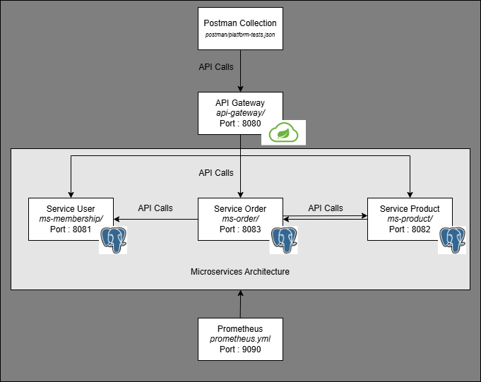

# Document d'Architecture Technique (DAT)

## Schéma d'architecture : 

## Description de chaque microservice :
- Service User (ms-membership/) -> Gestion des comptes utilisateurs
- Service Product (ms-product/) -> Gestion du catalogue de produit
- Service Order (ms-order/) -> Gestion des commandes 

## Choix technologiques justifiés :
- BDD unique -> PostgresSQL 
Technologie familière qu'on a déjà utilisé auparavant.

- API Gateway -> Spring Cloud
Technologie simple et compatible avec SpringBoot qui est utilisé dans ce TP.

## Stratégie de communication inter-services :
Appels API REST établies entre le Service Order et les Services User et Product pour la configuration des commandes. Une commande, régit par un utilisateur (lien Service User), contient un ou plusieurs produits du catalogue (lien Service Product). 