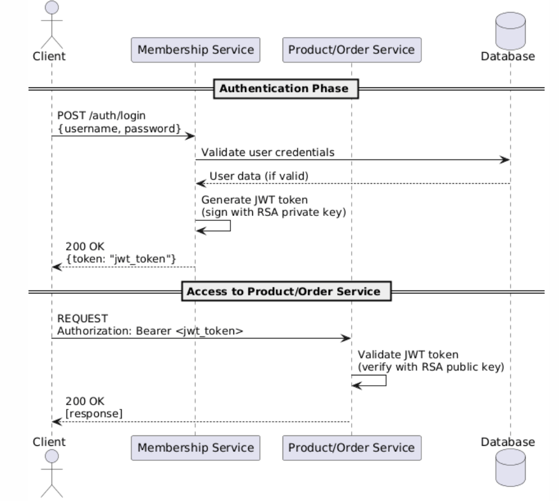

# Sécurité JWT - Documentation

## Architecture de sécurité

### Diagramme de séquence de l'authentification : 

### Composants implémentés

#### 1. Service Membership - Génération JWT

**Endpoint :** `POST /api/v1/auth/login`
- Accepte : `{"email": "string", "password": "string"}`
- Retourne : `{"token": "eyJhbGc...", "expiresIn": 3600}`

**Fonctionnalités :**
- Génération automatique de paires de clés RSA (2048 bits)
- Signature JWT avec algorithme RS256
- Expiration des tokens : 1 heure
- Stockage des clés dans `private_key.pem` et `public_key.pem`

#### 2. Services Product & Order - Validation JWT

**Sécurité Spring :**
- Filtre JWT personnalisé interceptant toutes les requêtes
- Validation de la signature RSA avec la clé publique
- Vérification de l'expiration des tokens
- Protection de tous les endpoints (sauf `/actuator/health`)

**Gestion des erreurs :**
- `401 Unauthorized` : Token manquant ou invalide
- `403 Forbidden` : Token expiré

#### 3. Communication inter-services sécurisée

- Propagation automatique du JWT dans les headers `Authorization`
- Gestion des erreurs 401 lors des appels entre services

## Format du JWT

### Header
```json
{
  "alg": "RS256",
  "typ": "JWT"
}
```

### Payload
```json
{
  "sub": "email@domain.com",
  "userId": 123,
  "email": "email@domain.com",
  "roles": "USER",
  "iat": 1640995200,
  "exp": 1640998800
}
```

### Signature
- Signée avec la clé privée RSA
- Validée avec la clé publique RSA

## Gestion des clés RSA

### Génération
- Clés générées automatiquement au démarrage du service Membership
- Taille : 2048 bits minimum
- Algorithme : RSA

### Distribution
- **Clé privée** : Service Membership uniquement (signature)
- **Clé publique** : Partagée avec Product et Order (validation)

### Stockage
- Fichiers : `private_key.pem` et `public_key.pem`
- Format : PKCS#8 pour la clé privée, X.509 pour la clé publique

## Gestion des erreurs

### Codes HTTP
- `200 OK` : Authentification réussie
- `401 Unauthorized` : Token invalide/manquant
- `403 Forbidden` : Token expiré
- `404 Not Found` : Utilisateur non trouvé
- `400 Bad Request` : Données invalides

### Logs
- Tentatives de connexion (succès/échec)
- Validation de tokens
- Erreurs de communication inter-services

## Tests
Voir le fichier postman/platform-secured.json et copier les tests sur postman.
### Scénario 1 : Connexion réussie
### Scénario 2 : Accès protégé avec token valide
### Scénario 3 : Accès sans token
### Scénario 4 : Token expiré
### Scénario 5 : Création commande complète

## Déploiement

### Prérequis
- Java 17+ (Product/Order) ou Java 21 (Membership)
- Clés RSA générées et distribuées

### Configuration
- Port Membership : 8081
- Port Product : 8082
- Port Order : 8083

### Variables d'environnement
```
APP_PORT=8081  # Pour chaque service
```
# Sécurité JWT - Documentation

## Architecture de sécurité

### Diagramme de séquence de l'authentification : 

### Composants implémentés

#### 1. Service Membership - Génération JWT

**Endpoint :** `POST /api/v1/auth/login`
- Accepte : `{"email": "string", "password": "string"}`
- Retourne : `{"token": "eyJhbGc...", "expiresIn": 3600}`

**Fonctionnalités :**
- Génération automatique de paires de clés RSA (2048 bits)
- Signature JWT avec algorithme RS256
- Expiration des tokens : 1 heure
- Stockage des clés dans `private_key.pem` et `public_key.pem`

#### 2. Services Product & Order - Validation JWT

**Sécurité Spring :**
- Filtre JWT personnalisé interceptant toutes les requêtes
- Validation de la signature RSA avec la clé publique
- Vérification de l'expiration des tokens
- Protection de tous les endpoints (sauf `/actuator/health`)

**Gestion des erreurs :**
- `401 Unauthorized` : Token manquant ou invalide
- `403 Forbidden` : Token expiré

#### 3. Communication inter-services sécurisée

- Propagation automatique du JWT dans les headers `Authorization`
- Gestion des erreurs 401 lors des appels entre services

## Format du JWT

### Header
```json
{
  "alg": "RS256",
  "typ": "JWT"
}
```

### Payload
```json
{
  "sub": "email@domain.com",
  "userId": 123,
  "email": "email@domain.com",
  "roles": "USER",
  "iat": 1640995200,
  "exp": 1640998800
}
```

### Signature
- Signée avec la clé privée RSA
- Validée avec la clé publique RSA

## Gestion des clés RSA

### Génération
- Clés générées automatiquement au démarrage du service Membership
- Taille : 2048 bits minimum
- Algorithme : RSA

### Distribution
- **Clé privée** : Service Membership uniquement (signature)
- **Clé publique** : Partagée avec Product et Order (validation)

### Stockage
- Fichiers : `private_key.pem` et `public_key.pem`
- Format : PKCS#8 pour la clé privée, X.509 pour la clé publique

## Gestion des erreurs

### Codes HTTP
- `200 OK` : Authentification réussie
- `401 Unauthorized` : Token invalide/manquant
- `403 Forbidden` : Token expiré
- `404 Not Found` : Utilisateur non trouvé
- `400 Bad Request` : Données invalides

### Logs
- Tentatives de connexion (succès/échec)
- Validation de tokens
- Erreurs de communication inter-services

## Tests
Voir le fichier postman/platform-secured.json et copier les tests sur postman.
### Scénario 1 : Connexion réussie
### Scénario 2 : Accès protégé avec token valide
### Scénario 3 : Accès sans token
### Scénario 4 : Token expiré
### Scénario 5 : Création commande complète

## Déploiement

### Prérequis
- Java 17+ (Product/Order) ou Java 21 (Membership)
- Clés RSA générées et distribuées

### Configuration
- Port Membership : 8081
- Port Product : 8082
- Port Order : 8083

### Variables d'environnement
```
APP_PORT=8081  # Pour chaque service
```